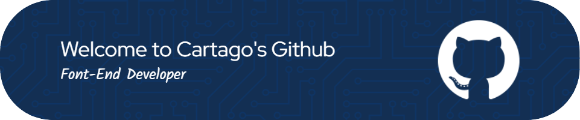

  

# Mario Cabrero Volarich

**Software engineer focused on frontend product work and independent TypeScript projects.**

I build web and Android interfaces for operational products, and I develop TypeScript libraries and tooling in my own time. This GitHub is a personal portfolio: the repositories below are independent work, not client or employer projects.

## Professional Frontend Experience

- **Operational applications:** Angular interfaces for business workflows with complex, repeated-use interaction and long-lived product rules.
- **Web and Android delivery:** Ionic applications, Capacitor and Cordova packaging, and UI work with TypeScript, RxJS, Angular Material, and Sass.
- **Delivery practice:** Docker-based development environments, Git/GitLab workflows, CI/CD jobs, and focused testing and maintenance work.

## Core Stack

**Frontend and mobile**

**Personal TypeScript, runtime, and tooling**

**Quality and delivery**

## Additional Skills

| Area | Technologies used in personal projects |
| --- | --- |
| Product interfaces | Vue, React, Vite, Nx, Tailwind CSS, Storybook, Electron |
| Data and application tooling | MongoDB, Mongoose, Prisma, Zod, Firebase, Docker Compose, Linux/WSL |
| AI and developer tooling | Model Context Protocol, OpenAI API, ESLint, Prettier, GitHub, GitLab |

`Bun` is my regular runtime and tooling choice. I do not present it as a production server platform.

## Independent Personal Projects

Everything in this section was built independently in my own time. It is separate from my professional work.

### Published

- [Keyer](https://github.com/CartagoGit/Keyer) - Published npm library and CLI for secrets, API keys, and environment-file encryption.

### In Active Development

- [MCP Vertex](https://github.com/CartagoGit/mcp-vertex) - TypeScript/Bun MCP tooling platform with CLI, plugins, tests, quality gates, and documentation. Release planned; not published yet.
- [QuickModel](https://github.com/CartagoGit/quickmodel) - TypeScript model tooling with validation integrations, security tests, benchmarks, and MCP support. Release planned; not published yet.

### Other Personal Work

- [Print CV](https://github.com/CartagoGit/print-cv) - Vue/TypeScript application with validation, Vitest, Playwright E2E coverage, Docker, and GitHub Actions deployment.
- [Zoneless Calculator](https://github.com/CartagoGit/zoneless-calculator) - Angular application exploring zoneless architecture through unit and integration tests.
- [NestGpt](https://github.com/CartagoGit/NestGpt) - NestJS and OpenAI API foundation with test and Docker workflows.
- [Development images](https://hub.docker.com/u/cartagodocker) - Personal Docker environments for Angular, Ionic, NestJS, Node/Bun, and Zsh workflows.

## GitHub Activity

  

  

