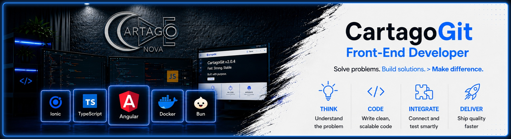
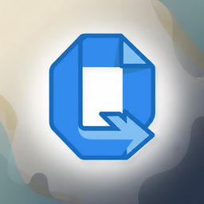

  

# Mario Cabrero Volarich

**Software engineer focused on frontend product work and independent TypeScript projects.**

I build web and Android interfaces for operational products, and I develop TypeScript libraries and tooling in my own time. This GitHub is a personal portfolio: the repositories below are independent work, not client or employer projects.

## Professional Frontend Experience

- **Operational applications:** Angular interfaces for business workflows with complex, repeated-use interaction and long-lived product rules.
- **Web and Android delivery:** Ionic applications, Capacitor packaging, and UI work with TypeScript, RxJS, Angular Material, and Sass.
- **Delivery practice:** Docker-based development environments, Git/GitLab workflows, CI/CD jobs, and focused testing and maintenance work.

## Portfolio Scope

**Personal work on this GitHub:** the repositories, packages, Docker images, and experiments documented here are independent projects built in my own time.

**Professional work:** separate, non-public work on operational web and Android products. My contribution is centered on Angular/RxJS interfaces, Ionic/Capacitor delivery, Sass and Angular Material UI systems, Kotlin/Java Capacitor plugins, Docker development environments, and GitLab CI/CD. Employer and client source code are intentionally not included in this portfolio.

## Core Stack

**Frontend and mobile**

**Personal TypeScript runtime and tooling**

<strong>Bun</strong> is my regular runtime for scripts, test flows, and workspace tooling. I do not present it as a primary production server platform.

**Quality and delivery**

## Additional Skills

**Product interfaces**

**Styling and UI systems**

**Build and workspace tooling**

**Data and application tooling**

**Mobile platform plugins**

**AI platforms and agents**

**Developer tooling**

## Independent Personal Projects

Everything in this section was built independently in my own time. It is separate from my professional work.

### Featured Projects

####  MCP Vertex

Language- and framework-agnostic MCP tooling platform, implemented in TypeScript/Bun, with a CLI, plugins, tests, quality gates, and documentation.

---

####  QuickModel

TypeScript model tooling with validation integrations, security tests, benchmarks, and MCP support.

---

####  Keyer

Published npm library and CLI for secrets, API keys, and environment-file encryption.

---

### Other Personal Work

- **Print CV** - Vue/TypeScript application with validation, Vitest, Playwright E2E coverage, Docker, and GitHub Actions deployment. 
- **Zoneless Calculator** - Angular application exploring zoneless architecture through unit and integration tests. 
- **NestGpt** - NestJS and OpenAI API foundation with test and Docker workflows. 

## Docker Hub Images

Public development images for local environments and repeatable tooling setups. Pull counts are live Docker Hub values.

- **Most used:**  
- **Most used:**  
-  
-  
-  
-  

## GitHub Activity

  

  

## Learning Games & Concept Demos

Personal, visual projects that complement the tooling above: four Angular/TypeScript learning games and one pre-alpha concept demo for a future game project.

### Learning Games

#### Chess (in development)

Angular and TypeScript exploration of chess rules, board state, reusable components, and Docker-based development and build environments.

#### Cartago Tetris

Completed desktop-first Angular game exploring a game loop, board state, keyboard controls, and scoring.

#### Cartago Snake

Completed desktop-first Angular game focused on real-time movement, keyboard input, collision detection, scoring, and game state.

#### Cartago Minesweeper

Completed desktop-first Angular game exploring grid interactions, mine generation, state transitions, timers, and score tracking.

### Concept Demo

#### DeathBlitz

Pre-alpha concept demo for a future combat-racing project. It currently demonstrates Angular 21 architecture, local persistence with IndexedDB, internationalization, pilot creation, vehicles, progression, upgrades, and game-oriented UI systems.

