

  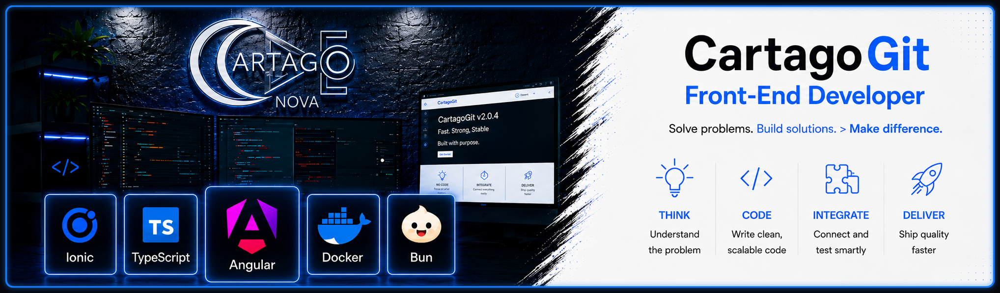

<h1 align="center">
   
  Mario Cabrero Volarich
</h1>

  <strong>Frontend engineer. Angular, Ionic and SCSS — plus the tooling and infrastructure to ship them.</strong> 
  Mentor · Technical decisions · Delivery · Angular · Ionic · Material · Sass · Bun · NestJS · Docker

  <a href="https://www.linkedin.com/in/mario-cabrero-volarich"><picture><source media="(prefers-color-scheme: light)" srcset="./assets/btn/light/linkedin.svg?v=3"></picture></a>
  <a href="https://www.npmjs.com/~cartago-git"><picture><source media="(prefers-color-scheme: light)" srcset="./assets/btn/light/npm-brand.svg?v=3"></picture></a>
  <a href="https://hub.docker.com/u/cartagodocker"><picture><source media="(prefers-color-scheme: light)" srcset="./assets/btn/light/docker.svg?v=3"></picture></a>
  <a href="https://cartagogit.github.io"><picture><source media="(prefers-color-scheme: light)" srcset="./assets/btn/light/portfolio.svg?v=3"></picture></a>

---

<picture><source media="(max-width: 499px) and (prefers-color-scheme: light)" srcset="./assets/summary/narrow/light/what-i-build-v7.svg"><source media="(max-width: 499px)" srcset="./assets/summary/narrow/what-i-build-v7.svg"><source media="(max-width: 1199px) and (prefers-color-scheme: light)" srcset="./assets/summary/mid/light/what-i-build-v7.svg"><source media="(max-width: 1199px)" srcset="./assets/summary/mid/what-i-build-v7.svg"><source media="(prefers-color-scheme: light)" srcset="./assets/summary/light/what-i-build-v7.svg"></picture>

**Front-end for operational systems.** ERP, warehouse logistics, workforce and attendance: the same
screens eight hours a day, with role-based permissions, complex validated forms and listings that
stay fast with years of data. My base is **Angular with SCSS**, **Ionic** when it needs to reach
Android, **Material** for the design system.

**Around the front-end.** Mentoring the team, deciding what stays in the front-end and what moves to
a service, deciding what gets a quality gate and what gets a written decision. GitLab CI,
GitHub Actions, Docker images with the versions pinned — the same environment on the laptop and
on the runner.

**Independent tooling.** Developer tools I needed and could not find: an MCP server with 62
capabilities, a static analysis engine for APIs, a serialization library, a secret manager. Each
one started from a concrete need in my own work.

Everything published here is **independent work** — repositories, libraries, images and
experiments built in my own time. My professional work is not published here.

---

<picture><source media="(max-width: 499px) and (prefers-color-scheme: light)" srcset="./assets/summary/narrow/light/featured-projects-v7.svg"><source media="(max-width: 499px)" srcset="./assets/summary/narrow/featured-projects-v7.svg"><source media="(max-width: 1199px) and (prefers-color-scheme: light)" srcset="./assets/summary/mid/light/featured-projects-v7.svg"><source media="(max-width: 1199px)" srcset="./assets/summary/mid/featured-projects-v7.svg"><source media="(prefers-color-scheme: light)" srcset="./assets/summary/light/featured-projects-v7.svg"></picture>

<picture><source media="(max-width: 350px) and (prefers-color-scheme: light)" srcset="./assets/cards/tiny/light/project-delendai-v5.svg"><source media="(max-width: 350px)" srcset="./assets/cards/tiny/project-delendai-v5.svg"><source media="(max-width: 799px) and (prefers-color-scheme: light)" srcset="./assets/cards/narrow/light/project-delendai-v5.svg"><source media="(max-width: 799px)" srcset="./assets/cards/narrow/project-delendai-v5.svg"><source media="(max-width: 1199px) and (prefers-color-scheme: light)" srcset="./assets/cards/mid/light/project-delendai-v5.svg"><source media="(max-width: 1199px)" srcset="./assets/cards/mid/project-delendai-v5.svg"><source media="(prefers-color-scheme: light)" srcset="./assets/cards/light/project-delendai-v5.svg">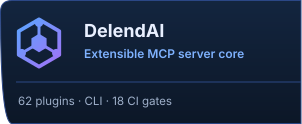</picture><a href="https://github.com/CartagoGit/DelendAI" aria-label="Open DelendAI repository"><picture><source media="(prefers-color-scheme: light)" srcset="./assets/btn/light/repository-project-dock-v4.svg"></picture></a><a href="https://github.com/CartagoGit/DelendAI/releases" aria-label="Open DelendAI releases"><picture><source media="(prefers-color-scheme: light)" srcset="./assets/btn/light/releases-project-dock-v4.svg"></picture></a><picture><source media="(prefers-color-scheme: light)" srcset="./assets/btn/light/card-cap-project-v5.svg"></picture>
<picture><source media="(max-width: 350px) and (prefers-color-scheme: light)" srcset="./assets/cards/tiny/light/project-tanit-v5.svg"><source media="(max-width: 350px)" srcset="./assets/cards/tiny/project-tanit-v5.svg"><source media="(max-width: 799px) and (prefers-color-scheme: light)" srcset="./assets/cards/narrow/light/project-tanit-v5.svg"><source media="(max-width: 799px)" srcset="./assets/cards/narrow/project-tanit-v5.svg"><source media="(max-width: 1199px) and (prefers-color-scheme: light)" srcset="./assets/cards/mid/light/project-tanit-v5.svg"><source media="(max-width: 1199px)" srcset="./assets/cards/mid/project-tanit-v5.svg"><source media="(prefers-color-scheme: light)" srcset="./assets/cards/light/project-tanit-v5.svg">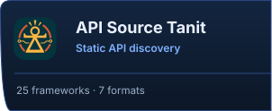</picture><a href="https://github.com/CartagoGit/api-source-tanit" aria-label="Open API Source Tanit repository"><picture><source media="(prefers-color-scheme: light)" srcset="./assets/btn/light/repository-project-dock-v4.svg"></picture></a><a href="https://github.com/CartagoGit/api-source-tanit/releases" aria-label="Open API Source Tanit releases"><picture><source media="(prefers-color-scheme: light)" srcset="./assets/btn/light/releases-project-dock-v4.svg"></picture></a><picture><source media="(prefers-color-scheme: light)" srcset="./assets/btn/light/card-cap-project-v5.svg"></picture>
<picture><source media="(max-width: 350px) and (prefers-color-scheme: light)" srcset="./assets/cards/tiny/light/project-quickmodel-v5.svg"><source media="(max-width: 350px)" srcset="./assets/cards/tiny/project-quickmodel-v5.svg"><source media="(max-width: 799px) and (prefers-color-scheme: light)" srcset="./assets/cards/narrow/light/project-quickmodel-v5.svg"><source media="(max-width: 799px)" srcset="./assets/cards/narrow/project-quickmodel-v5.svg"><source media="(max-width: 1199px) and (prefers-color-scheme: light)" srcset="./assets/cards/mid/light/project-quickmodel-v5.svg"><source media="(max-width: 1199px)" srcset="./assets/cards/mid/project-quickmodel-v5.svg"><source media="(prefers-color-scheme: light)" srcset="./assets/cards/light/project-quickmodel-v5.svg">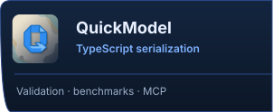</picture><a href="https://github.com/CartagoGit/quickmodel" aria-label="Open QuickModel repository"><picture><source media="(prefers-color-scheme: light)" srcset="./assets/btn/light/repository-project-dock-v4.svg"></picture></a><a href="https://cartagogit.github.io/quickmodel/" aria-label="Open QuickModel documentation"><picture><source media="(prefers-color-scheme: light)" srcset="./assets/btn/light/docs-project-dock-v4.svg"></picture></a><picture><source media="(prefers-color-scheme: light)" srcset="./assets/btn/light/card-cap-project-v5.svg"></picture>
<picture><source media="(max-width: 350px) and (prefers-color-scheme: light)" srcset="./assets/cards/tiny/light/project-keyer-v5.svg"><source media="(max-width: 350px)" srcset="./assets/cards/tiny/project-keyer-v5.svg"><source media="(max-width: 799px) and (prefers-color-scheme: light)" srcset="./assets/cards/narrow/light/project-keyer-v5.svg"><source media="(max-width: 799px)" srcset="./assets/cards/narrow/project-keyer-v5.svg"><source media="(max-width: 1199px) and (prefers-color-scheme: light)" srcset="./assets/cards/mid/light/project-keyer-v5.svg"><source media="(max-width: 1199px)" srcset="./assets/cards/mid/project-keyer-v5.svg"><source media="(prefers-color-scheme: light)" srcset="./assets/cards/light/project-keyer-v5.svg">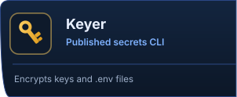</picture><a href="https://github.com/CartagoGit/Keyer" aria-label="Open Keyer repository"><picture><source media="(prefers-color-scheme: light)" srcset="./assets/btn/light/repository-project-dock-v4.svg"></picture></a><a href="https://www.npmjs.com/package/@cartago-git/keyer" aria-label="Open Keyer on npm"><picture><source media="(prefers-color-scheme: light)" srcset="./assets/btn/light/npm-project-dock-v4.svg"></picture></a><picture><source media="(prefers-color-scheme: light)" srcset="./assets/btn/light/card-cap-project-v5.svg"></picture>
<picture><source media="(max-width: 350px) and (prefers-color-scheme: light)" srcset="./assets/cards/tiny/light/project-print-cv-v5.svg"><source media="(max-width: 350px)" srcset="./assets/cards/tiny/project-print-cv-v5.svg"><source media="(max-width: 799px) and (prefers-color-scheme: light)" srcset="./assets/cards/narrow/light/project-print-cv-v5.svg"><source media="(max-width: 799px)" srcset="./assets/cards/narrow/project-print-cv-v5.svg"><source media="(max-width: 1199px) and (prefers-color-scheme: light)" srcset="./assets/cards/mid/light/project-print-cv-v5.svg"><source media="(max-width: 1199px)" srcset="./assets/cards/mid/project-print-cv-v5.svg"><source media="(prefers-color-scheme: light)" srcset="./assets/cards/light/project-print-cv-v5.svg">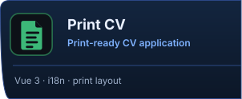</picture><a href="https://github.com/CartagoGit/print-cv" aria-label="Open Print CV repository"><picture><source media="(prefers-color-scheme: light)" srcset="./assets/btn/light/repository-project-dock-v4.svg"></picture></a><a href="https://cartagogit.github.io/print-cv/" aria-label="Open Print CV live app"><picture><source media="(prefers-color-scheme: light)" srcset="./assets/btn/light/live-project-dock-v4.svg"></picture></a><picture><source media="(prefers-color-scheme: light)" srcset="./assets/btn/light/card-cap-project-v5.svg"></picture>
<picture><source media="(max-width: 350px) and (prefers-color-scheme: light)" srcset="./assets/cards/tiny/light/project-cartago-v5.svg"><source media="(max-width: 350px)" srcset="./assets/cards/tiny/project-cartago-v5.svg"><source media="(max-width: 799px) and (prefers-color-scheme: light)" srcset="./assets/cards/narrow/light/project-cartago-v5.svg"><source media="(max-width: 799px)" srcset="./assets/cards/narrow/project-cartago-v5.svg"><source media="(max-width: 1199px) and (prefers-color-scheme: light)" srcset="./assets/cards/mid/light/project-cartago-v5.svg"><source media="(max-width: 1199px)" srcset="./assets/cards/mid/project-cartago-v5.svg"><source media="(prefers-color-scheme: light)" srcset="./assets/cards/light/project-cartago-v5.svg">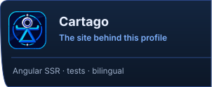</picture><a href="https://github.com/CartagoGit/portfolio" aria-label="Open Cartago portfolio repository"><picture><source media="(prefers-color-scheme: light)" srcset="./assets/btn/light/repository-project-dock-v4.svg"></picture></a><a href="https://cartagogit.github.io" aria-label="Open Cartago live site"><picture><source media="(prefers-color-scheme: light)" srcset="./assets/btn/light/live-project-dock-v4.svg"></picture></a><picture><source media="(prefers-color-scheme: light)" srcset="./assets/btn/light/card-cap-project-v5.svg"></picture>

---

<picture>
<source media="(max-width: 499px) and (prefers-color-scheme: light)" srcset="./assets/summary/narrow/light/docker-images-v7.svg">
<source media="(max-width: 499px)" srcset="./assets/summary/narrow/docker-images-v7.svg">
<source media="(max-width: 1199px) and (prefers-color-scheme: light)" srcset="./assets/summary/mid/light/docker-images-v7.svg">
<source media="(max-width: 1199px)" srcset="./assets/summary/mid/docker-images-v7.svg">
<source media="(prefers-color-scheme: light)" srcset="./assets/summary/light/docker-images-v7.svg">
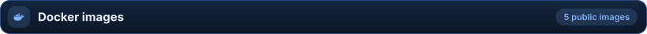
</picture>

<picture><source media="(max-width: 350px) and (prefers-color-scheme: light)" srcset="./assets/cards/tiny/light/docker-nodebun-v3.svg"><source media="(max-width: 350px)" srcset="./assets/cards/tiny/docker-nodebun-v3.svg"><source media="(max-width: 799px) and (prefers-color-scheme: light)" srcset="./assets/cards/narrow/light/docker-nodebun-v3.svg"><source media="(max-width: 799px)" srcset="./assets/cards/narrow/docker-nodebun-v3.svg"><source media="(prefers-color-scheme: light)" srcset="./assets/cards/light/docker-nodebun-v3.svg">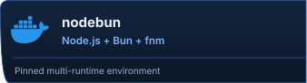</picture><a href="https://hub.docker.com/r/cartagodocker/nodebun"><picture><source media="(prefers-color-scheme: light)" srcset="./assets/btn/light/docker-compact-dock-v4.svg"></picture></a><picture><source media="(prefers-color-scheme: light)" srcset="./assets/btn/light/card-cap-compact-v5.svg"></picture>
<picture><source media="(max-width: 350px) and (prefers-color-scheme: light)" srcset="./assets/cards/tiny/light/docker-zsh-v3.svg"><source media="(max-width: 350px)" srcset="./assets/cards/tiny/docker-zsh-v3.svg"><source media="(max-width: 799px) and (prefers-color-scheme: light)" srcset="./assets/cards/narrow/light/docker-zsh-v3.svg"><source media="(max-width: 799px)" srcset="./assets/cards/narrow/docker-zsh-v3.svg"><source media="(prefers-color-scheme: light)" srcset="./assets/cards/light/docker-zsh-v3.svg">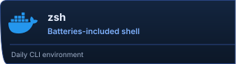</picture><a href="https://hub.docker.com/r/cartagodocker/zsh"><picture><source media="(prefers-color-scheme: light)" srcset="./assets/btn/light/docker-compact-dock-v4.svg"></picture></a><picture><source media="(prefers-color-scheme: light)" srcset="./assets/btn/light/card-cap-compact-v5.svg"></picture>
<picture><source media="(max-width: 350px) and (prefers-color-scheme: light)" srcset="./assets/cards/tiny/light/docker-ionic-v3.svg"><source media="(max-width: 350px)" srcset="./assets/cards/tiny/docker-ionic-v3.svg"><source media="(max-width: 799px) and (prefers-color-scheme: light)" srcset="./assets/cards/narrow/light/docker-ionic-v3.svg"><source media="(max-width: 799px)" srcset="./assets/cards/narrow/docker-ionic-v3.svg"><source media="(prefers-color-scheme: light)" srcset="./assets/cards/light/docker-ionic-v3.svg">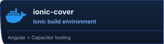</picture><a href="https://hub.docker.com/r/cartagodocker/ionic-cover"><picture><source media="(prefers-color-scheme: light)" srcset="./assets/btn/light/docker-compact-dock-v4.svg"></picture></a><picture><source media="(prefers-color-scheme: light)" srcset="./assets/btn/light/card-cap-compact-v5.svg"></picture>
<picture><source media="(max-width: 350px) and (prefers-color-scheme: light)" srcset="./assets/cards/tiny/light/docker-nestjs-v3.svg"><source media="(max-width: 350px)" srcset="./assets/cards/tiny/docker-nestjs-v3.svg"><source media="(max-width: 799px) and (prefers-color-scheme: light)" srcset="./assets/cards/narrow/light/docker-nestjs-v3.svg"><source media="(max-width: 799px)" srcset="./assets/cards/narrow/docker-nestjs-v3.svg"><source media="(prefers-color-scheme: light)" srcset="./assets/cards/light/docker-nestjs-v3.svg">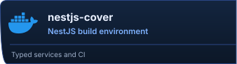</picture><a href="https://hub.docker.com/r/cartagodocker/nestjs-cover"><picture><source media="(prefers-color-scheme: light)" srcset="./assets/btn/light/docker-compact-dock-v4.svg"></picture></a><picture><source media="(prefers-color-scheme: light)" srcset="./assets/btn/light/card-cap-compact-v5.svg"></picture>
<picture><source media="(max-width: 350px) and (prefers-color-scheme: light)" srcset="./assets/cards/tiny/light/docker-angular-v3.svg"><source media="(max-width: 350px)" srcset="./assets/cards/tiny/docker-angular-v3.svg"><source media="(max-width: 799px) and (prefers-color-scheme: light)" srcset="./assets/cards/narrow/light/docker-angular-v3.svg"><source media="(max-width: 799px)" srcset="./assets/cards/narrow/docker-angular-v3.svg"><source media="(max-width: 1199px) and (prefers-color-scheme: light)" srcset="./assets/cards/mid/light/docker-angular-v3.svg"><source media="(max-width: 1199px)" srcset="./assets/cards/mid/docker-angular-v3.svg"><source media="(prefers-color-scheme: light)" srcset="./assets/cards/light/docker-angular-v3.svg">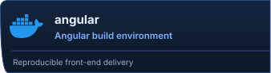</picture><a href="https://hub.docker.com/r/cartagodocker/angular"><picture><source media="(prefers-color-scheme: light)" srcset="./assets/btn/light/docker-compact-dock-v4.svg"></picture></a><picture><source media="(prefers-color-scheme: light)" srcset="./assets/btn/light/card-cap-compact-v5.svg"></picture>

---

<picture><source media="(max-width: 499px) and (prefers-color-scheme: light)" srcset="./assets/summary/narrow/light/professional-experience-v7.svg"><source media="(max-width: 499px)" srcset="./assets/summary/narrow/professional-experience-v7.svg"><source media="(max-width: 1199px) and (prefers-color-scheme: light)" srcset="./assets/summary/mid/light/professional-experience-v7.svg"><source media="(max-width: 1199px)" srcset="./assets/summary/mid/professional-experience-v7.svg"><source media="(prefers-color-scheme: light)" srcset="./assets/summary/light/professional-experience-v7.svg"></picture>

- **Operational front-end delivery.** Business applications for commercial, financial, inventory, logistics and workforce processes. Complex states, role-based permissions, reporting and business rules that must not break between releases.
- **Web and Android.** Angular and Ionic applications, packaged for Android with Capacitor, plus Vue and Quasar for the management panels and progressive web apps for what has to work without being installed. Interfaces designed for repeated, high-context use.
- **Mentoring and technical decisions.** I mentor the team, choose the architecture and settle the trade-offs: what stays in the front-end, what moves to a service, what gets a gate and what gets a document.
- **Delivery foundations.** Dockerised development environments, GitLab CI and GitHub Actions pipelines, container images, and focused test coverage on the parts that actually break.
- **AI-assisted, human-owned.** I use AI assistants for implementation; the architecture decisions, the code review and the acceptance criteria are mine.

---

<picture><source media="(max-width: 499px) and (prefers-color-scheme: light)" srcset="./assets/summary/narrow/light/beyond-front-end-v7.svg"><source media="(max-width: 499px)" srcset="./assets/summary/narrow/beyond-front-end-v7.svg"><source media="(max-width: 1199px) and (prefers-color-scheme: light)" srcset="./assets/summary/mid/light/beyond-front-end-v7.svg"><source media="(max-width: 1199px)" srcset="./assets/summary/mid/beyond-front-end-v7.svg"><source media="(prefers-color-scheme: light)" srcset="./assets/summary/light/beyond-front-end-v7.svg"></picture>

- **Developer tooling.** An MCP server with 62 capabilities, a model serialization library and a static analysis engine, built because the tools I wanted did not exist.
- **Backend and runtime.** NestJS, Bun and Node for the services that sit behind the interfaces; SQLite and PostgreSQL for the data.
- **Games and content.** Local-first desktop apps in Tauri and Rust, games in Godot and C#, and schema-validated content pipelines with localisation.
- **Infrastructure.** Public Docker images for Angular, Ionic, NestJS, Node/Bun and Zsh, all with pinned version matrices.

---

<picture><source media="(max-width: 499px) and (prefers-color-scheme: light)" srcset="./assets/summary/narrow/light/how-i-work-v7.svg"><source media="(max-width: 499px)" srcset="./assets/summary/narrow/how-i-work-v7.svg"><source media="(max-width: 1199px) and (prefers-color-scheme: light)" srcset="./assets/summary/mid/light/how-i-work-v7.svg"><source media="(max-width: 1199px)" srcset="./assets/summary/mid/how-i-work-v7.svg"><source media="(prefers-color-scheme: light)" srcset="./assets/summary/light/how-i-work-v7.svg"></picture>

- **Proposals before code.** Every non-trivial change starts as a written proposal with a goal, a design, slices, acceptance criteria and a risk section. Nothing lands without a machine-checkable acceptance test.
- **Tests as a ratchet.** Coverage thresholds only ever move upwards, and the script that enforces them fails the build when they slip.
- **Quality gates, not opinions.** Lint, typecheck, tests, generated-file drift, catalogue consistency and i18n parity run in CI — 18 workflows in the runtime core alone.
- **Documentation as code.** Architecture decision records (ADRs) are numbered and committed next to the code they explain; the runtime core carries more than 2,000 Markdown files.
- **AI-assisted delivery, human-owned decisions.** Work is routed through a proposal → implement → review → release pipeline where the agent proposes and the gates decide.
- **Bun first.** `bun` is the daily runtime for scripts, tests and workspaces; Node.js remains supported where production demands it.
- **Local-first and private by default.** Keys, databases and secrets stay on the machine, and repositories ship the `.gitignore` that guarantees it.

---

<picture><source media="(max-width: 499px) and (prefers-color-scheme: light)" srcset="./assets/summary/narrow/light/github-activity-v7.svg"><source media="(max-width: 499px)" srcset="./assets/summary/narrow/github-activity-v7.svg"><source media="(max-width: 1199px) and (prefers-color-scheme: light)" srcset="./assets/summary/mid/light/github-activity-v7.svg"><source media="(max-width: 1199px)" srcset="./assets/summary/mid/github-activity-v7.svg"><source media="(prefers-color-scheme: light)" srcset="./assets/summary/light/github-activity-v7.svg"></picture>

<picture><source media="(prefers-color-scheme: light)" srcset="./assets/activity/streak-light.svg"></picture>

<picture><source media="(prefers-color-scheme: light)" srcset="./assets/activity/graph-light.svg"></picture>

<picture><source media="(prefers-color-scheme: light)" srcset="./assets/activity/stats-light.svg">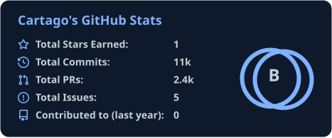</picture><picture><source media="(prefers-color-scheme: light)" srcset="./assets/activity/langs-light.svg"></picture>

---

<picture><source media="(max-width: 499px) and (prefers-color-scheme: light)" srcset="./assets/summary/narrow/light/evidence-v7.svg"><source media="(max-width: 499px)" srcset="./assets/summary/narrow/evidence-v7.svg"><source media="(max-width: 1199px) and (prefers-color-scheme: light)" srcset="./assets/summary/mid/light/evidence-v7.svg"><source media="(max-width: 1199px)" srcset="./assets/summary/mid/evidence-v7.svg"><source media="(prefers-color-scheme: light)" srcset="./assets/summary/light/evidence-v7.svg">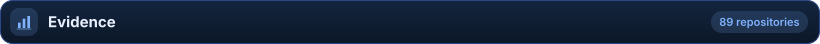</picture>

<a href="https://github.com/CartagoGit/DelendAI"><picture><source media="(prefers-color-scheme: light)" srcset="./assets/cards/light/evidence-delendai-v3.svg">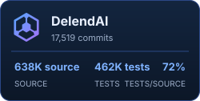</picture></a>
<a href="https://github.com/CartagoGit/api-source-tanit"><picture><source media="(prefers-color-scheme: light)" srcset="./assets/cards/light/evidence-tanit-v3.svg"></picture></a>
<a href="https://github.com/CartagoGit/quickmodel"><picture><source media="(prefers-color-scheme: light)" srcset="./assets/cards/light/evidence-quickmodel-v3.svg"></picture></a>
<a href="https://github.com/CartagoGit/player-club-dynasty"><picture><source media="(prefers-color-scheme: light)" srcset="./assets/cards/light/evidence-pcd-v3.svg">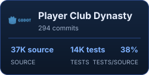</picture></a>
<a href="https://github.com/CartagoGit/steam-keys"><picture><source media="(prefers-color-scheme: light)" srcset="./assets/cards/light/evidence-steam-keys-v3.svg">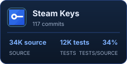</picture></a>
<a href="https://github.com/CartagoGit/aoe2-mods"><picture><source media="(prefers-color-scheme: light)" srcset="./assets/cards/light/evidence-aoe2-v3.svg">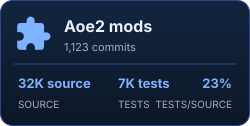</picture></a>
<a href="https://github.com/CartagoGit/portfolio"><picture><source media="(prefers-color-scheme: light)" srcset="./assets/cards/light/evidence-portfolio-v3.svg">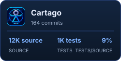</picture></a>
<a href="https://github.com/CartagoGit/print-cv"><picture><source media="(prefers-color-scheme: light)" srcset="./assets/cards/light/evidence-print-cv-v3.svg"></picture></a>

**89 repositories** — 68 public and 21 private. **26** active. Source lines exclude tests, fixtures and generated files; test lines are the suites themselves.

---

<picture><source media="(max-width: 499px) and (prefers-color-scheme: light)" srcset="./assets/summary/narrow/light/core-stack-v7.svg"><source media="(max-width: 499px)" srcset="./assets/summary/narrow/core-stack-v7.svg"><source media="(max-width: 1199px) and (prefers-color-scheme: light)" srcset="./assets/summary/mid/light/core-stack-v7.svg"><source media="(max-width: 1199px)" srcset="./assets/summary/mid/core-stack-v7.svg"><source media="(prefers-color-scheme: light)" srcset="./assets/summary/light/core-stack-v7.svg"></picture>

**Front-end — my base**

<picture><source media="(prefers-color-scheme: light)" srcset="./assets/btn/light/tech-angular.svg?v=3"></picture> <picture><source media="(prefers-color-scheme: light)" srcset="./assets/btn/light/tech-ionic.svg?v=3"></picture> <picture><source media="(prefers-color-scheme: light)" srcset="./assets/btn/light/tech-material.svg?v=3"></picture> <picture><source media="(prefers-color-scheme: light)" srcset="./assets/btn/light/tech-sass.svg?v=3"></picture> <picture><source media="(prefers-color-scheme: light)" srcset="./assets/btn/light/tech-typescript.svg?v=3"></picture> <picture><source media="(prefers-color-scheme: light)" srcset="./assets/btn/light/tech-rxjs.svg?v=3"></picture> <picture><source media="(prefers-color-scheme: light)" srcset="./assets/btn/light/tech-capacitor.svg?v=3"></picture> <picture><source media="(prefers-color-scheme: light)" srcset="./assets/btn/light/tech-tailwind.svg?v=3"></picture> <picture><source media="(prefers-color-scheme: light)" srcset="./assets/btn/light/tech-vue.svg?v=3"></picture> <picture><source media="(prefers-color-scheme: light)" srcset="./assets/btn/light/tech-react.svg?v=3"></picture>

**Services, data & runtime**

<picture><source media="(prefers-color-scheme: light)" srcset="./assets/btn/light/tech-nestjs.svg?v=3"></picture> <picture><source media="(prefers-color-scheme: light)" srcset="./assets/btn/light/tech-bun.svg?v=3"></picture> <picture><source media="(prefers-color-scheme: light)" srcset="./assets/btn/light/tech-nodejs.svg?v=3"></picture> <picture><source media="(prefers-color-scheme: light)" srcset="./assets/btn/light/tech-postgresql.svg?v=3"></picture> <picture><source media="(prefers-color-scheme: light)" srcset="./assets/btn/light/tech-sqlite.svg?v=3"></picture> <picture><source media="(prefers-color-scheme: light)" srcset="./assets/btn/light/tech-mongodb.svg?v=3"></picture> <picture><source media="(prefers-color-scheme: light)" srcset="./assets/btn/light/tech-zod.svg?v=3"></picture> <picture><source media="(prefers-color-scheme: light)" srcset="./assets/btn/light/tech-openapi.svg?v=3"></picture>

**Tooling & AI infrastructure**

<picture><source media="(prefers-color-scheme: light)" srcset="./assets/btn/light/tech-mcp.svg?v=3"></picture> <picture><source media="(prefers-color-scheme: light)" srcset="./assets/btn/light/tech-tauri.svg?v=3"></picture> <picture><source media="(prefers-color-scheme: light)" srcset="./assets/btn/light/tech-rust.svg?v=3"></picture> <picture><source media="(prefers-color-scheme: light)" srcset="./assets/btn/light/tech-godot.svg?v=3"></picture> <picture><source media="(prefers-color-scheme: light)" srcset="./assets/btn/light/tech-python.svg?v=3"></picture> <picture><source media="(prefers-color-scheme: light)" srcset="./assets/btn/light/tech-storybook.svg?v=3"></picture> <picture><source media="(prefers-color-scheme: light)" srcset="./assets/btn/light/tech-primeng.svg?v=3"></picture>

**Quality & delivery**

<picture><source media="(prefers-color-scheme: light)" srcset="./assets/btn/light/tech-vitest.svg?v=3"></picture> <picture><source media="(prefers-color-scheme: light)" srcset="./assets/btn/light/tech-jest.svg?v=3"></picture> <picture><source media="(prefers-color-scheme: light)" srcset="./assets/btn/light/tech-playwright.svg?v=3"></picture> <picture><source media="(prefers-color-scheme: light)" srcset="./assets/btn/light/tech-eslint.svg?v=3"></picture> <picture><source media="(prefers-color-scheme: light)" srcset="./assets/btn/light/tech-prettier.svg?v=3"></picture> <picture><source media="(prefers-color-scheme: light)" srcset="./assets/btn/light/tech-docker.svg?v=3"></picture> <picture><source media="(prefers-color-scheme: light)" srcset="./assets/btn/light/tech-gitlab.svg?v=3"></picture> <picture><source media="(prefers-color-scheme: light)" srcset="./assets/btn/light/tech-actions.svg?v=3"></picture> <picture><source media="(prefers-color-scheme: light)" srcset="./assets/btn/light/tech-linux.svg?v=3"></picture>

**With AI**

<picture><source media="(prefers-color-scheme: light)" srcset="./assets/btn/light/tech-claude.svg?v=3"></picture> <picture><source media="(prefers-color-scheme: light)" srcset="./assets/btn/light/tech-codex.svg?v=3"></picture> <picture><source media="(prefers-color-scheme: light)" srcset="./assets/btn/light/tech-minimax.svg?v=3"></picture> <picture><source media="(prefers-color-scheme: light)" srcset="./assets/btn/light/tech-grok.svg?v=3"></picture> <picture><source media="(prefers-color-scheme: light)" srcset="./assets/btn/light/tech-gemini.svg?v=3"></picture> <picture><source media="(prefers-color-scheme: light)" srcset="./assets/btn/light/tech-qwen.svg?v=3"></picture> <picture><source media="(prefers-color-scheme: light)" srcset="./assets/btn/light/tech-glm.svg?v=3"></picture> <picture><source media="(prefers-color-scheme: light)" srcset="./assets/btn/light/tech-mimo.svg?v=3"></picture> <picture><source media="(prefers-color-scheme: light)" srcset="./assets/btn/light/tech-mai.svg?v=3"></picture>

---

<picture><source media="(max-width: 499px) and (prefers-color-scheme: light)" srcset="./assets/summary/narrow/light/more-projects-v7.svg"><source media="(max-width: 499px)" srcset="./assets/summary/narrow/more-projects-v7.svg"><source media="(max-width: 1199px) and (prefers-color-scheme: light)" srcset="./assets/summary/mid/light/more-projects-v7.svg"><source media="(max-width: 1199px)" srcset="./assets/summary/mid/more-projects-v7.svg"><source media="(prefers-color-scheme: light)" srcset="./assets/summary/light/more-projects-v7.svg"></picture>

<picture><source media="(max-width: 350px) and (prefers-color-scheme: light)" srcset="./assets/cards/tiny/light/more-nestgpt-v3.svg"><source media="(max-width: 350px)" srcset="./assets/cards/tiny/more-nestgpt-v3.svg"><source media="(max-width: 799px) and (prefers-color-scheme: light)" srcset="./assets/cards/narrow/light/more-nestgpt-v3.svg"><source media="(max-width: 799px)" srcset="./assets/cards/narrow/more-nestgpt-v3.svg"><source media="(prefers-color-scheme: light)" srcset="./assets/cards/light/more-nestgpt-v3.svg">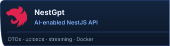</picture><a href="https://github.com/CartagoGit/NestGpt"><picture><source media="(prefers-color-scheme: light)" srcset="./assets/btn/light/repository-compact-dock-v4.svg"></picture></a><picture><source media="(prefers-color-scheme: light)" srcset="./assets/btn/light/card-cap-compact-v5.svg"></picture>
<picture><source media="(max-width: 350px) and (prefers-color-scheme: light)" srcset="./assets/cards/tiny/light/more-reactgpt-v3.svg"><source media="(max-width: 350px)" srcset="./assets/cards/tiny/more-reactgpt-v3.svg"><source media="(max-width: 799px) and (prefers-color-scheme: light)" srcset="./assets/cards/narrow/light/more-reactgpt-v3.svg"><source media="(max-width: 799px)" srcset="./assets/cards/narrow/more-reactgpt-v3.svg"><source media="(prefers-color-scheme: light)" srcset="./assets/cards/light/more-reactgpt-v3.svg">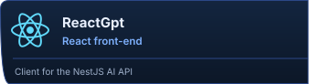</picture><a href="https://github.com/CartagoGit/ReactGpt"><picture><source media="(prefers-color-scheme: light)" srcset="./assets/btn/light/repository-compact-dock-v4.svg"></picture></a><picture><source media="(prefers-color-scheme: light)" srcset="./assets/btn/light/card-cap-compact-v5.svg"></picture>
<picture><source media="(max-width: 350px) and (prefers-color-scheme: light)" srcset="./assets/cards/tiny/light/more-zoneless-v3.svg"><source media="(max-width: 350px)" srcset="./assets/cards/tiny/more-zoneless-v3.svg"><source media="(max-width: 799px) and (prefers-color-scheme: light)" srcset="./assets/cards/narrow/light/more-zoneless-v3.svg"><source media="(max-width: 799px)" srcset="./assets/cards/narrow/more-zoneless-v3.svg"><source media="(prefers-color-scheme: light)" srcset="./assets/cards/light/more-zoneless-v3.svg">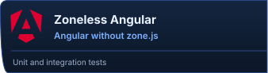</picture><a href="https://github.com/CartagoGit/zoneless-calculator"><picture><source media="(prefers-color-scheme: light)" srcset="./assets/btn/light/repository-compact-dock-v4.svg"></picture></a><picture><source media="(prefers-color-scheme: light)" srcset="./assets/btn/light/card-cap-compact-v5.svg"></picture>
<picture><source media="(max-width: 350px) and (prefers-color-scheme: light)" srcset="./assets/cards/tiny/light/more-aoe2-v3.svg"><source media="(max-width: 350px)" srcset="./assets/cards/tiny/more-aoe2-v3.svg"><source media="(max-width: 799px) and (prefers-color-scheme: light)" srcset="./assets/cards/narrow/light/more-aoe2-v3.svg"><source media="(max-width: 799px)" srcset="./assets/cards/narrow/more-aoe2-v3.svg"><source media="(prefers-color-scheme: light)" srcset="./assets/cards/light/more-aoe2-v3.svg">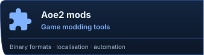</picture><a href="https://github.com/CartagoGit/aoe2-mods"><picture><source media="(prefers-color-scheme: light)" srcset="./assets/btn/light/repository-compact-dock-v4.svg"></picture></a><picture><source media="(prefers-color-scheme: light)" srcset="./assets/btn/light/card-cap-compact-v5.svg"></picture>
<picture><source media="(max-width: 350px) and (prefers-color-scheme: light)" srcset="./assets/cards/tiny/light/more-pcfutbol-v3.svg"><source media="(max-width: 350px)" srcset="./assets/cards/tiny/more-pcfutbol-v3.svg"><source media="(max-width: 799px) and (prefers-color-scheme: light)" srcset="./assets/cards/narrow/light/more-pcfutbol-v3.svg"><source media="(max-width: 799px)" srcset="./assets/cards/narrow/more-pcfutbol-v3.svg"><source media="(prefers-color-scheme: light)" srcset="./assets/cards/light/more-pcfutbol-v3.svg">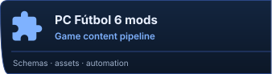</picture><a href="https://github.com/CartagoGit/pcfutbol6-mod"><picture><source media="(prefers-color-scheme: light)" srcset="./assets/btn/light/repository-compact-dock-v4.svg"></picture></a><picture><source media="(prefers-color-scheme: light)" srcset="./assets/btn/light/card-cap-compact-v5.svg"></picture>
<picture><source media="(max-width: 350px) and (prefers-color-scheme: light)" srcset="./assets/cards/tiny/light/more-pcd-v3.svg"><source media="(max-width: 350px)" srcset="./assets/cards/tiny/more-pcd-v3.svg"><source media="(max-width: 799px) and (prefers-color-scheme: light)" srcset="./assets/cards/narrow/light/more-pcd-v3.svg"><source media="(max-width: 799px)" srcset="./assets/cards/narrow/more-pcd-v3.svg"><source media="(prefers-color-scheme: light)" srcset="./assets/cards/light/more-pcd-v3.svg">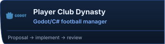</picture><a href="https://github.com/CartagoGit/player-club-dynasty"><picture><source media="(prefers-color-scheme: light)" srcset="./assets/btn/light/repository-compact-dock-v4.svg"></picture></a><picture><source media="(prefers-color-scheme: light)" srcset="./assets/btn/light/card-cap-compact-v5.svg"></picture>
<picture><source media="(max-width: 350px) and (prefers-color-scheme: light)" srcset="./assets/cards/tiny/light/more-steam-keys-v3.svg"><source media="(max-width: 350px)" srcset="./assets/cards/tiny/more-steam-keys-v3.svg"><source media="(max-width: 799px) and (prefers-color-scheme: light)" srcset="./assets/cards/narrow/light/more-steam-keys-v3.svg"><source media="(max-width: 799px)" srcset="./assets/cards/narrow/more-steam-keys-v3.svg"><source media="(prefers-color-scheme: light)" srcset="./assets/cards/light/more-steam-keys-v3.svg">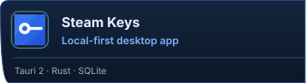</picture><a href="https://github.com/CartagoGit/steam-keys"><picture><source media="(prefers-color-scheme: light)" srcset="./assets/btn/light/repository-compact-dock-v4.svg"></picture></a><picture><source media="(prefers-color-scheme: light)" srcset="./assets/btn/light/card-cap-compact-v5.svg"></picture>
<picture><source media="(max-width: 350px) and (prefers-color-scheme: light)" srcset="./assets/cards/tiny/light/more-template-angular-v3.svg"><source media="(max-width: 350px)" srcset="./assets/cards/tiny/more-template-angular-v3.svg"><source media="(max-width: 799px) and (prefers-color-scheme: light)" srcset="./assets/cards/narrow/light/more-template-angular-v3.svg"><source media="(max-width: 799px)" srcset="./assets/cards/narrow/more-template-angular-v3.svg"><source media="(prefers-color-scheme: light)" srcset="./assets/cards/light/more-template-angular-v3.svg">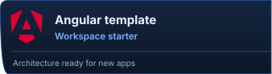</picture><a href="https://github.com/CartagoGit/template-angular"><picture><source media="(prefers-color-scheme: light)" srcset="./assets/btn/light/repository-compact-dock-v4.svg"></picture></a><picture><source media="(prefers-color-scheme: light)" srcset="./assets/btn/light/card-cap-compact-v5.svg"></picture>
<picture><source media="(max-width: 350px) and (prefers-color-scheme: light)" srcset="./assets/cards/tiny/light/more-codember-v3.svg"><source media="(max-width: 350px)" srcset="./assets/cards/tiny/more-codember-v3.svg"><source media="(max-width: 799px) and (prefers-color-scheme: light)" srcset="./assets/cards/narrow/light/more-codember-v3.svg"><source media="(max-width: 799px)" srcset="./assets/cards/narrow/more-codember-v3.svg"><source media="(prefers-color-scheme: light)" srcset="./assets/cards/light/more-codember-v3.svg">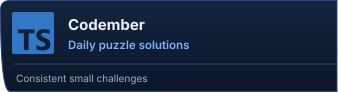</picture><a href="https://github.com/CartagoGit/codember-dev"><picture><source media="(prefers-color-scheme: light)" srcset="./assets/btn/light/repository-compact-dock-v4.svg"></picture></a><picture><source media="(prefers-color-scheme: light)" srcset="./assets/btn/light/card-cap-compact-v5.svg"></picture>
<picture><source media="(max-width: 350px) and (prefers-color-scheme: light)" srcset="./assets/cards/tiny/light/more-codewars-v3.svg"><source media="(max-width: 350px)" srcset="./assets/cards/tiny/more-codewars-v3.svg"><source media="(max-width: 799px) and (prefers-color-scheme: light)" srcset="./assets/cards/narrow/light/more-codewars-v3.svg"><source media="(max-width: 799px)" srcset="./assets/cards/narrow/more-codewars-v3.svg"><source media="(prefers-color-scheme: light)" srcset="./assets/cards/light/more-codewars-v3.svg">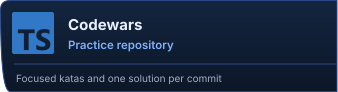</picture><a href="https://github.com/CartagoGit/codewars"><picture><source media="(prefers-color-scheme: light)" srcset="./assets/btn/light/repository-compact-dock-v4.svg"></picture></a><picture><source media="(prefers-color-scheme: light)" srcset="./assets/btn/light/card-cap-compact-v5.svg"></picture>

---

Independent work, published in my own time. Professional and client work is not published here.

